## 1980

{:style="float: left;margin-right: 15px;margin-top: 5px;"}
[Zork I: The Great Underground Empire](games/zork1)

Zork I beckons you into a world fraught with danger and discovery. Using all the cunning you can muster, you'll plunge far below the surface of the earth in search of the incomparable Treasures of Zork. But this is no mere treasure hunt. During your amazing journey, you'll come face to face with creatures so outlandish, they defy description. And you'll wander through an underground domain so vast, with so many twists and turns, it can offer you new surprises no matter how many times you explore it.
  

## 1981

{:style="float: left;margin-right: 15px;margin-top: 5px;"}
[Zork II: The Wizard of Frobozz](games/zork2)

As you explore the subterranean realm of Zork, you'll continually be confronted with new surprises. Chief among these is the Wizard himself, who'll constantly endeavor to confound you with his capricious powers. But more than that, you'll face a challenge the likes of which you've never experienced before.
  

## 1982

[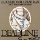](http://infodoc.plover.net/manuals/temp/deadline.pdf)
{:style="float: left;margin-right: 15px;margin-top: 5px;"}
[Deadline](games/deadline)

Deadline pits you, the keen-eyed sleuth, against a 12-hour time limit to solve a classic locked-door mystery. Armed only with the clues inside this package and your own wits, you must sift through the myriads of evidence and motives to track down the killer. No easy feat, for all of your subjects exercise free will - coming and going, scheming and maneuvering independently of your actions. And some of these personalities are so treacherous that, should you make the wrong move, one of them may do you in.
  

{:style="float: left;margin-right: 15px;margin-top: 5px;"}
[Zork III: The Dungeon Master](games/zork3)

Zork III draws you into the deepest and most mysterious reaches of the Great Underground Empire. Nothing is as it seems. And the one responsible for the shadow and darkness - the Dungeon Master - embodies the greatest mystery of all. In this test of wisdom and courage, you will face countless dangers. But what awaits you at the culmination of your odyssey is well worth risking all.
  

{:style="float: left;margin-right: 15px;margin-top: 5px;"}
[Starcross](games/starcross)

Starcross, Infocom's science fiction mind-bender, launches you headlong into the year 2186 and the depths of space. And not without good reason, for you are destined to rendezvous with a gargantuan starship from the outer fringes of the galaxy. Upon docking with the strange craft, you must succeed in gaining entry to its mysterious interior. Once within, you will encounter a microcosm of the galaxy, peopled with both harmful and helpful beings. But the great starship serves a far larger purpose than mere cultural exchange. It bears a challenge that was issued eons ago, from light-years away- and only you can meet it.
  

## 1983

{:style="float: left;margin-right: 15px;margin-top: 5px;"}
[Suspended](games/suspended)

They said you would sleep for half a millennium -- not an unreasonable length of time, considering you'd be in limited cryogenic suspension. Your body would rest frozen at the planet's nerve center, an underground complex 20 miles beneath the surface. Your brain, they told you, would be wired to a network of computers; your mind would continue to operate at a minimal level, overseeing maintenance of surface-side equilibrium. And you would not awake, so they promised, until your 500 years had elapsed -- barring, of course, the most dire emergency. Then, and only then, you would be awakened to save your planet by strategically manipulating six robots, each of whom perceives the world differently. But such a catastrophe, you have been assured, could not possibly occur. Good morning.
  

{:style="float: left;margin-right: 15px;margin-top: 5px;"}
[The Witness](games/witness)

February 1938, Los Angeles. FDR's New Deal is finally rolling. Hitler's rolling, too; this time through Austria. But as Chief Detective for a quiet burgh on the outskirts of L.A., you've got other fish to fry. One gilt-edged society dame is dead. And now it looks like some two-bit grifter is putting the screws to her multi-millionaire old man. Then you step in and the shakedown turns ugly. You're left with a stiff and a race against the clock to nail your suspect... unless you get nailed first! Nobody said a sordid familiy affair like this was going to be a cinch. Everyone from the knock-out heiress to the poker-faced butler may end up in the slammer before it's over. Ahead of you is a Gordian knot of motives and alibis. And the only testimony you can trust is that of your own eyes -- because you are The Witness.
  

[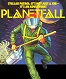](http://infodoc.plover.net/manuals/planetfa.pdf)
{:style="float: left;margin-right: 15px;margin-top: 5px;"}
[Planetfall](games/planetfall)

"Join the Patrol, and see the Galaxy!" You took the poster's advice, bait and all, and marched right over to the recruitment station near your home on the backwater planet of Gallium. Images of exotic worlds, strange and colorful aliens and Deep Space heroism had danced in your head as you signed the dotted line. And since that day the closest you've come to Deep Space heroism was scrubbing down the radioactive leper colony on Ishmael-3. But suppose that jumbo fortune cookie you got at Qwang's Take-Out Asteroid last shore leave was right. Maybe you will indeed narrowly escape disaster. It's even possible that you'll actually travel to an unknown corner of the Universe, where you'll save a doomed planet- or die in the attempt. In fact, we'll guarantee it - every crumb of it - because that's just the way the cosmic cookie crumbles.
  

[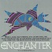](http://infodoc.plover.net/manuals/temp/enchante.pdf)
{:style="float: left;margin-right: 15px;margin-top: 5px;"}
[Enchanter](games/enchanter)

In Enchanter, the first of a spellbinding series in the tradition of Zork, you are a novice magician whom Fate has chosen to do singlehanded combat with a dark and fierce power. But wordly weapons will avail you naught, for your foe is the Evil Warlock who holds sway over the land. To defeat him, you will have to match your skills as a necromancer against his, casting spells you have learned from your masters in the Circle of Enchanters and other incantations you will acquire as you proceed on your quest. If you succeed, you will be elevated to a seat in the illustrious Circle; if you fail, your land will be doomed to an eternity of darkness. 
  

{:style="float: left;margin-right: 15px;margin-top: 5px;"}
[Infidel](games/infidel)

Infidel finds you marooned by your followers in the heart of the deadly Egyptian Desert. A soldier of fortune by trade, you've come hither in search of a great lost pyramid and its untold riches. Now, alone, you must locate and gain entry to the tomb, decipher its hieroglyphics and unravel its mysteries one by one. Through the Antechamber, the Barge Room, the Chamber of Ra, death will lick at your heels as you race to the shattering climax of this match of wits between you and the most ingenious architects, builders and murderers of all time -- the ancient Egyptians.
  

## 1984

{:style="float: left;margin-right: 15px;margin-top: 5px;"}
[Sorcerer](games/sorcerer)

Sorcerer, the second of a spellbinding fantasy series in the tradition of Zork, takes you on a magical tour through the darker side of Zorkian enchantment. Your journey begins with a cryptic diary - the last trace of the now-vanished Belboz the Necromancer, grand and powerful leader of the Guild of Enchanters. It is feared that Belboz is in thrall to evil sorcery. If so, the very existence of the Circle of Enchanters could be forfeit. To rescue the kingdom and locate your mentor in the treacherous mists of time, you must gain the power and cunning of a true Sorcerer.
  

[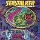](http://infodoc.plover.net/manuals/temp/seastalk.pdf)
{:style="float: left;margin-right: 15px;margin-top: 5px;"}
[Seastalker](games/seastalker)

There's something down the in the ocean, something terrifying. And you have to face it -- because only you can save the Aquadome, the world's first undersea research station. The alarm sounds, and your submarine, the Scimitar, is docked nearby. But not so fast -- you haven't even tested the Scimitar in deep water, and the crew in the Aquadome may have a traitor in its ranks. So be careful! You have many possibilities to consider, mysteries to unravel and life-and-death decisions to make! Success won't come easily. It may not come at all -- because, if you challenge the deep without using all your wits, you just might wind up as shark bait! 
  

{:style="float: left;margin-right: 15px;margin-top: 5px;"}
[Cutthroats](games/cutthroats)

You're about to get yourself into very deep trouble. You're a backwater island's top diver and foremost expert on local shipwrecks. Which makes you perfect for the job a band of the island's shadiest characters has in mind for you. It's a simple business proposition: all you have to do is salvage a fortune in sunken treasures. You stand to gain millions. The only drawback is, it could cost you your neck. Because to successfully recover the treasure, you'll have to survive the perils of diving in unknown waters - and the even greater danger of an untrustworthy crew. But none of that will stop you from taking the plunge. You're the type who believes that when stakes are this high, even when your odds are this low, it's worth running the risks of dealing with Cutthroats.
  

{:style="float: left;margin-right: 15px;margin-top: 5px;"}
[The Hitchhiker's Guide to the Galaxy](games/hitchhikers)

As the story begins, you are Arthur Dent, and a bulldozer is preparing to level your house even as an alien space fleet is preparing to level your planet. The incorrigible Mr. Adams has written new material and designed problems especially for this interactive story. So grab a pint of bitter and a couple for the road and join Ford Prefect, Trillian, Zaphod Beeblebrox and Marvin on a cosmic jaunt into the outer reaches where anything can -- and does -- happen. And don't forget your towel!
  

{:style="float: left;margin-right: 15px;margin-top: 5px;"}
[Suspect](games/suspect)

You're guilty until proven innocent. You have walked into a hotbed of deceit and trickery. And now they're accusing you of something you couldn't have done. But they have proof that you did it. "You're a killer," they say. And until you can prove them wrong, you're guilty as charged - murder. Among society's upper crust, murder is the kind of nastiness that must be cleaned up quickly. So isn't it convenient that you, a struggling journalist looking for a good time and a good story, end up the scapegoat? The evidence is stacked against you, and you're being forced to prove your own innocence. And someone else's guilt. But, no one wants to help you. You're an outsider. And only an outsider could be so rude as to accept an invitation to the social event of the season. Then spoil it all.
  

## 1985

[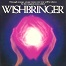](http://infodoc.plover.net/manuals/wishbrin.pdf)
{:style="float: left;margin-right: 15px;margin-top: 5px;"}
[Wishbringer: The Magick Stone of Dreams](games/wishbringer)

It's an ordinary day in your ordinary little town, and you've been performing your ordinary mail clerk's duties in an altogether ordinary way. But there's something quite extraordinary in today's mail. It's a ranson note for a kidnapped cat, and it will lead you through unbelievably harrowing adventures to Wishbringer, a stone possessing undreamt-of powers. For though the note in question is addressed to someone in your ordinary little town, it's postmarked for Special Delivery to Parts Unknown. And its true destination is somewhere beyond your wildest dreams, c/o the magic of Infocom's interactive fiction.
  

{:style="float: left;margin-right: 15px;margin-top: 5px;"}
[A Mind Forever Voyaging](games/amfv)

It's 2031. The world is on the brink of chaos. In the United States of North America, spiraling crime and unemployment rates, decayed school systems and massive government regulations have led to a lazy, contentious society. To reverse this critical situation, government and industry leaders have developed a Plan combining the economic freedom and strong moral values of the 1950's with the technological advancements of the 21st century. Will the Plan ensure peace and prosperity? Or will it set the earth on a suicide course to destruction? As the world's first conscious, intelligent computer, only you can visit places that have never been seen before. Only you can view the future. And only you know what must be done to save humanity.
  

{:style="float: left;margin-right: 15px;margin-top: 5px;"}
[Spellbreaker](games/spellbreaker)

A world founded on sorcery suddenly finds its magic failing, and only you, leader of the Circle of Enchanters, can uncover and destroy the cause of this paralyzing chaos. The very core of your civilization is under siege, and only a perilous journey through the black foundation of magic itself will yield a chance for survival. And although your triumph over this unknown Evil is uncertain, you must embark without hesitation and prove yourself the worthiest mage in the land.
  

## 1986

{:style="float: left;margin-right: 15px;margin-top: 5px;"}
[Ballyhoo](games/ballyhoo)

Spangleland! Sawdust and glitter, buffoons and cotton candy! It's a place where your wildest dreams can come true! At least, that's what you think...until you get behind the scenes at the big top. Then you learn how easily sweet dreams can turn into nightmares. Beyond the spangles lies a seedy world of deception and crime. Exploring the tattered corners of the circus lot, you overhear a conversation about the owner's daughter. It seems she's been kidnapped, and the hired gumshoe couldn't find the nose on his face. Good samaritan that you are, you start poking around on your own. But watch your step. As the night progresses, you realize you're in as much danger as the little girl. For the kidnapper is lurking right there on the lot, trying to set you up for a permanent slot in the freak show.
  

[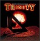](http://infodoc.plover.net/manuals/temp/trinity.pdf)
{:style="float: left;margin-right: 15px;margin-top: 5px;"}
[Trinity](games/trinity)

It's the last day of your $599 London vacation. Unfortunately, it's also the first day of World War III. Only seconds remain before an H-bomb vaporizes the city.. and you with it. Unless you escape to another time, another dimension. For every atomic explosion unlocks the door to a secret universe; a plane between fantasy and reality, filled with curious artifacts and governed by its own mischievous logic. You'll criscross time and space as you explore this fascinating universe, learning to control its inexorable power. Trinity leads you an a journey back to the dawn of the atomic age... and puts the course of history in your hands. 
  

[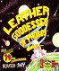](http://infodoc.plover.net/manuals/leather.pdf)
{:style="float: left;margin-right: 15px;margin-top: 5px;"}
[Leather Goddesses of Phobos](games/lgop)

And now...the next exciting episode of humanoids in space! How did you, a regular at Joe's Bar in Upper Sandusky, Ohio, end up on a Martian moon? Can you prevent the hideous space creatures from abducting the naked heiress? Why does scratch 'n' sniff #2 smell so familiar? How many uses can you find for a rubber hose? Is it easy to remove a brass bikini? Is it hard to outsmart a robotoid sumo wrestler? Can you stop the Leather Goddesses' fiendish plan to turn all Earthlings into sex slaves?
  

{:style="float: left;margin-right: 15px;margin-top: 5px;"}
[Moonmist](games/moonmist)

More Ghosts haunt the misty seacoast and stone ramparts of Cornwall than anyplace else on earth. One such soul roams Tresyllian Castle: a pale phantom with flaxen hair and a luminous, flowing gown. It seems like a fanciful legend... until the spectral "White Lady" threatens the life of your friend Tamara! Arriving at the fog-shrouded castle, you meet a cast of eccentric characters ranging from a blue-blood debutante to an overly helpful butler. Has one of them donned the ghostly guise of the White Lady? Or has the drowned love of Lord Jack, Tamara's fiance, returned to haunt her successor? Perhaps the spectre is seeking the valuable treasure hidden somewhere in the lavish rooms and secret passageways of the castle. The solution to the mystery, as well as the location of the treasure, changes in each of the four variations of MOONMIST. Get ready to spend the night in a haunted castle. But don't sleep too soundly. The next victim might be you. 
  

## 1987

{:style="float: left;margin-right: 15px;margin-top: 5px;"}
[Hollywood Hijinx](games/hollywood)

Your uncle Buddy and Aunt Hildegarde have passed away, but their memory lives on in their Malibu mansion, filled with a lifetime of Hollywood memorabilia. And you've inherited it all, with one stipulation- you can only claim your booty if you find the treasures hidden throughout the sprawling beachfront estate. If you can't find the treasures in one night, you lose the whole caboodle. It's just the sort of thing you'd expect from Aunt Hildegarde and Uncle Buddy. And their home is familiar territory: you spent your childhood summers there with your cousin Herman. Although some say the house is haunted, you're not fooled. You know that Uncle Buddy, who wore a different polyester leisure suit each day of the week, was always rigging the place with goofy gags and booby traps. Inside the house, everything is just as glitzy and full of fun as you remember it to be. There's the luxurious private screening room, the gold-plated bathroom faucets in the shape of Oscars, and the wacky props from old Buddy Burbank movies. The Malibu estate seems like a funhouse at first. But the puzzles you must solve prove that Aunt Hildegarde and Uncle Buddy weren't just kidding around. Claiming the Burbank bundle turns out to be quite a challenge- and it's all in your honor.
  

[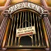](http://infodoc.plover.net/manuals/bureaucr.pdf)
{:style="float: left;margin-right: 15px;margin-top: 5px;"}
[Bureaucracy](games/bureaucracy)

You've just landed a great new job and moved to a spiffy house in a nice little town. You're even being sent to Paris this very afternoon for a combination training seminar and vacation. What could possibly go wrong? The answer, of course, is everthing. When the bank refuses to acknowledge your change-of-address form, you'll find yourself entangled in a series of bureaucratic mishaps that take you from the feeding trough of a greedy llama to the lofty branches of a tree deep in the Zalagasan jungle.
  

{:style="float: left;margin-right: 15px;margin-top: 5px;"}
[Stationfall](games/stationfall)

What a trotting krip! Since your incredible heroics in Planetfall, where you risked life and limb to save the planet Resida, things have hardly changed at all. Sure, you were promoted to Lieutenant First Class, but this only meant that your dull life of cleaning grotch cages was replaced by an equally dull life of paperwork. Now you've got another assignment tailor- made for a grotchbrain: pilot a spacetruck to a nearby station to pick up a load of trivial forms. Trot and double trot! But all is not lost. By a happy twist of fate, your companion for the journey is your old pal Floyd! That's right, it's the same mischievous little robot, crayons and paddleball at the ready, who was your helpful buddy in Planetfall. Getting to the space station is easy. But once there, you find it strangely deserted. Even the seedy space village surrounding the station is missing its ragtag tenants. A spooky alien ship carrying only an empty pedestal rests in a docking bay. An ostrich and an Arcturian balloon creature are found, abandoned but in perfect health. The commander's log describes the mysterious breakdown of machinery, demonstrated by a roving hull-welder who seems bent on your destruction. And finally even Floyd begins acting oddly... 
  

{:style="float: left;margin-right: 15px;margin-top: 5px;"}
[The Lurking Horror](games/lurking)

Ever since you arrived at G.U.E. Tech, you've heard stories about the creepy old campus basements and storage rooms, some so ancient that they contain only rotting piles of unidentifiable junk. Until now, you have never ventured lower than the ground floors of the monolithic classroom and dorm buildings, avoiding the warren of tunnels that connect them. But tonight, something draws you down into the mysterious depths of the institute. Perhaps it's the blizzard raging outside, making the outdoors as threatening as anything you could imagine within. Perhaps it's the nightmare you had, hinting at horrific mysteries below and leaving you with a strange object that seems to lead you inexorably downward. Or perhaps it's just another way for you to avoid writing that twenty page term paper you have due tomorrow. In any event, you soon find yourself wandering away from your computer and into the dark nether regions of G.U.E. Tech. Suddenly, you're in a world that rivals your most hideous visions, a realm of horror lurking beneath the calm corridors and study halls. Shapes emerge from dark corners. Eerie sounds draw closer. Slimy passageways lead to sights so horrifying that they will feed you nightmares for weeks.
  

[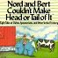](http://infodoc.plover.net/manuals/temp/nordandb.pdf)
{:style="float: left;margin-right: 15px;margin-top: 5px;"}
[Nord and Bert Couldn't Make Head or Tail of It](games/nordandbert)

 Infocom's first collection of short stories takes you to a place where nothing is quite as it seems. It's a place where you really can make a mountain out of a molehill, where 'the fur is flying' is taken literally, and where a bow can be turned into a beau. Each of the eight stories in Nord and Bert Couldn't Make Head or Tail of It involves a different type wordplay. You'll find yourself challenging your wits and your memory to come up with the cliches, spoonerisms, and other verbal trickeries needed to complete the puzzles. But don't view this as a hard row to hoe. Nord and Bert contains built-in hints, which you can call upon when the going gets rough. All eight stories take place in the mixed-up Town of Punster. However, no two contain the same people, locations, or objects. Each is played independently of the others, although you'll use passwords obtained in seven of the stories to get into the eighth. As for mapping, it's out the window. You simply type where you want to go.
  

{:style="float: left;margin-right: 15px;margin-top: 5px;"}
[Plundered Hearts](games/plundered)

 In the 17th century, the seas are as wild as the untamed heart of a young woman. But when you set out on the schooner Lafond Deux, bound for the West Indies, your thoughts are only of your ailing father who awaits your care. Little do you know that your innocent journey will soon turn to dangerous adventure. You barely survive an encounter with pirates, whose plans for you include a fate worse than death. The explosives, the rocky reefs, the vicious crocodile - all these are obstacles which you must overcome with cunning and agility. True, it's not easy; but at least you can control your fate. What you cannot control is much more dangerous: your passion for Nicholas Jarmison, the handsome pirate captain. Tall and lean, with azure eyes that penetrate deep into your soul, he makes your blood quicken despite his unsavory past. When you're in his arms, swirling around the dance floor or secluded in the flowered depths of the gazebo, you are apt to forget your mission. But don't dally too long with Nick. For your father is waiting, and on his rescue lies the fate of more than one man. Prepare for adventure on the high seas, lass. You'll need every bit of pluck you can muster.
  

{:style="float: left;margin-right: 15px;margin-top: 5px;"}
[Beyond Zork](games/beyondzork)

Dream times have befallen then Kingdom of Quendor. The wizards have mysteriously disappeared. The Enchanter's Guild Hall lies in ruins. Villages are abandoned, drunken men mutter strange tales, and vicious monsters haunt the streets and wastelands. Now it falls on you, a lowly peasant, to unravel the meaning behind these ominous events. Will you accept the challenge? Of course you will. For you're a hardy adventurer, ready to confront the most fearsome foe. And in , you have an arsenal of new weapons and abilities at your disposal. You start by designing your own character. Choose from such diverse attributes as strength, endurance, compasion, and luck, or let the computer select for you. As you venture onward, your character will evolve, reflecting your success in your quest. Beyond Zork's sophisticated new interface makes interactions more natural than ever. In the heat of battle, the special function keys let you strike the decisive blow with a single keystroke. There's even an on-screen map to chart your progress! As you grow in experience and abilities, you realize that you're being prepared for a great task, a task of which you know nothing... as yet. Your search for the answer will lead you deep underground, where unspeakable monsters guard the world's most fabulous treasure - the fabled Coconut of Quendor.
  

{:style="float: left;margin-right: 15px;margin-top: 5px;"}
[Border Zone](games/borderzone)

Where the Iron Curtain divides East and West, the frontier is a no man's land between freedom and captivity, a place where moments lost or precautions not taken exact a toll in men's lives. In Border Zone, you cross this barrier not once, but three times, as three different characters in a fast-paced story of international intrigue. The pulse-pounding tension of espionage is heightened by the addition of real time, which ticks on regardless of your actions. As you race against the clock to complete your missions, you'll find yourself caught up in a spine-tingling adventure that's far more suspenseful than any spy thriller you've ever read. The story begins on the train to Litzenburg, a peaceful country just outside the Iron Curtain. In the border town of Ostnitz, Constitution day festivities include a speech by the American ambassador. But plans are afoot to destabilize this key neutral territory by assassinating the diplomat. Speeding towards the border through the Eastern bloc country of Frobnia are an easy-going American businessman, an ambitious American spy and a ruthless KGB agent. All three are soon to become entangled in the assassination plot, their lives intertwining as each carries out his perilous assignment. You'll see the story from three viewpoints, as you step into the shoes of a different major character in each of the three chapters of Border Zone. Set in separate locations on or near the border, the chapters are complete stories in themselves, each with its own riveting conclusion. The on-line hints in Border Zone will help you out when you need it. But hints take you only so far. Even when you know exactly what to do, discretion and timing are crucial as you outwit the KGB, evade a snarling pack of search dogs, make a desperate assault on the border, and count down the moments to the assassination.
  

{:style="float: left;margin-right: 15px;margin-top: 5px;"}
[Sherlock](games/sherlock)

Travel back in time to Victorian London, where the city is bustling with preparations for Her Majesty's Golden Jubilee. Crowds of sightseers and souvenir vendors fill the streets in eager anticipation of the Jubilee Week events. Newspapers detail the gala array of festivities. Sumptuous receptions for foreign dignitaries. Special services at Westminster Abbey. A Royal Procession through the streets of London. And the Queen reigning over all, resplendent in the Crown Jewels. At least, that's the official plan. Unbeknownst to the celebrants thronging the city, a crisis has arisen: the Crown Jewels have been stolen from the Tower of London. If they're not recovered before the festivities begin, the theft will be exposed and the government will fall into international disgrace. Only 48 hours remain to solve the crime. With Scotland Yard failing to make headway, the Prime Minister calls on Sherlock Holmes, the famous consulting detective. But riddles left at the scene of the crime include a direct challenge to Holmes, who suspects a deadly trap. To throw the scoundrel off his guard, Holmes turns the investigation over to you, his trusted cohort, Dr. Watson. With Holmes by your side, you use your wits, intuition, and myriad of clues to solve the riddles and piece together the mystery. Your search for the jewels and the villain leads you all over London, from the most popular tourist attractions to the seediest back alleys. As Big Ben strikes each successive hour and dangerous complications impede your progress, you realize you're facing that most dastardly of foes, Holmes's archnemesis... the vile Professor Moriarty. 
  

## 1988

{:style="float: left;margin-right: 15px;margin-top: 5px;"}
[Zork Zero](games/zorkzero)

The Great Underground Empire is in its heyday. Upscale condos crowd the massive caverns. Subterranean highways stretch from Aragain to the Fublio Valley. And no adventurer has yet set foot in the open field west of the white house. But now both town and countryside are being abandoned, their inhabitants fleeing in the wake of a dread wizard's curse. The curse has already disposed of the royal Flathead family. It threatens to destroy the entire kingdom - unless you can stop it. Your quest will take you to every corner of the empire, as you seek out objects ranging from the absurd to the sublime. The quixotic jester will test you with games, riddles, and tricks. The the immense Flathead palace and its environs offer a multitude of surprises.
  

## 1989

{:style="float: left;margin-right: 15px;margin-top: 5px;"}
[Shogun](games/shogun)

The year is 1600. You are John Blackthorne, Pilot-Major of a privateering merchant ship and the first Englishman to set foot on Japanese soil. Thrust into the exotic culture of feudal Japan, you must rely on your wits and sheer physical strength to survive. As you are drawn into the political intrigue and teeming violence, your most basic beliefs and assumptions will be tested. Act with care: in the land were honor is valued above life itself, you make a wrong decision at your peril.
  

[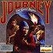](http://infodoc.plover.net/manuals/temp/journey.pdf)
{:style="float: left;margin-right: 15px;margin-top: 5px;"}
[Journey](games/journey)

In Journey, you become part of a mesmerizing epic created in the tradition of J.R.R. Tolkien's The Lord of the Rings. For five long years, failed crops, tainted water, and sickness have blighted a peaceful land. Brave villagers have set forth to find relief for their suffering region, but none have returned. Now, yet another small band is preparing to begin the odyssey. You'll share the adventures of Tag, Praxis, Bergn, Esher, and Minar as they solve puzzles, overcome obstacles, explore unknown lands.
  

[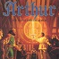](http://infodoc.plover.net/manuals/temp/arthur.pdf)
{:style="float: left;margin-right: 15px;margin-top: 5px;"}
[Arthur](games/arthur)

In the days before Camelot, when magic and evil rule England, a sword sheathed in stone appears in a quiet churchyard. Engraved upon it are the words which form your destiny. For you are Arthur, the son and true heir of the High King, Uther Pendragon. But there is more to asserting your claim than wresting free the sword. The sword in the stone disappears -- stolen by the evil King Lot. To win it back, you must develop the kingly qualities of wisdom, chivalry, and experience, qualities that will also prove you worthy of the throne. And you must do it all within three days, or Lot will usurp your legacy. You are assisted by Merlin the Enchanter, who grants you the power to transform yourself into a variety of animals. Now you can explore the kingdom as no one has before: from the sky, from rivers and lakes, from on -- and under -- the earth. How you use this power, and how you solve the myriad puzzles that confront you, will determine your success in your quest.
  
